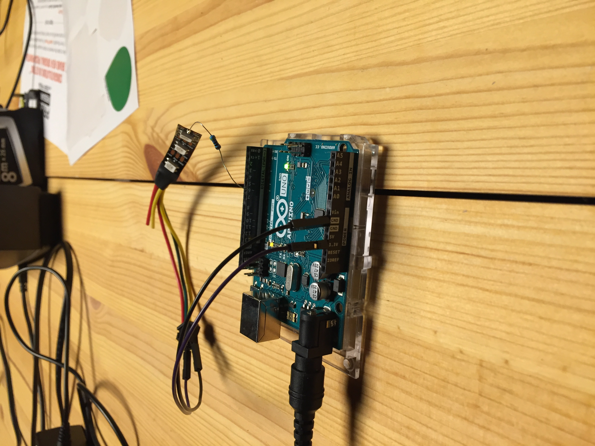

# Lightpedalproject

Project for peddling light for cool band Numbah Ten!

{: width=600px align=left}
Have placed arduino on table in lab, connect as in the picture and it should light up running this code:

    #include <Adafruit_NeoPixel.h>

    #define PIN      6
    #define N_LEDS 3

    Adafruit_NeoPixel strip = Adafruit_NeoPixel(N_LEDS, PIN, NEO_GRB + NEO_KHZ800);

    void setup() {
    strip.begin();
    }

    void loop() {
    chase(strip.Color(255, 0, 0)); // Red
    chase(strip.Color(0, 255, 0)); // Green
    chase(strip.Color(0, 0, 255)); // Blue
    }

    static void chase(uint32_t c) {
    for(uint16_t i=0; i<strip.numPixels()+1; i++) {
    strip.setPixelColor(i  , c); // Draw new pixel
    strip.setPixelColor(i-1, 0); // Erase pixel a few steps back
    strip.show();
    delay(500);
    }
    }

There is a connector arduino to usb on the table, if anyone feels like bending the code to our will while in the lab, feel free to tinker and upload new code and test stuff.

[Here is a link to the Arduino IDE](https://www.arduino.cc/en/Main.Software)