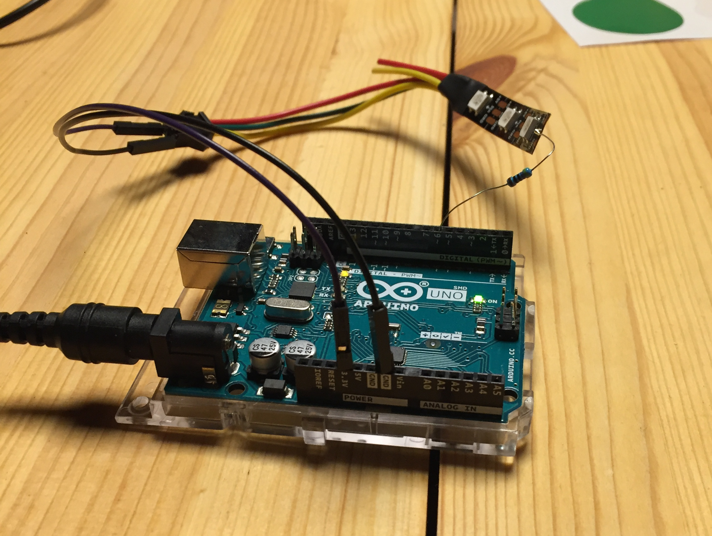
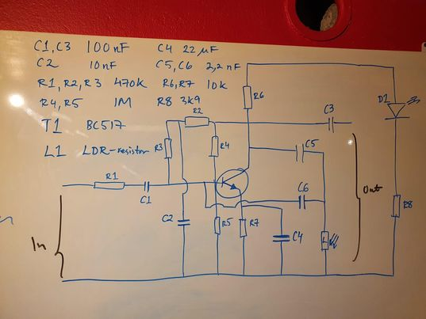

# Light Pedal

> Effect pedal project for Numbah Ten!

*This is the first creation apart from the creation of the lab to be logged here - we're still figuring out how to do this in a simple but tidy way.*
*I don't know if we want all documentation to be here, or if every project page should have its own repo and wiki and this rather functions as an introduction page
linking to the repo and wiki, I'm obviosly thinking while writing here; but anyhow it seems good to adopt the spirit of a wiki and hacking: change stuff and write stuff
and make mistakes!*

## Project overview
There is a light sensor wah wah - pedal. We want to mod it so that instead of operating it by blocking light, it is operated by shining light on it.
To set the frequency of the schwaang, the idea is to press a button connected to an arduino 3-4 times, detecting the average time between pushes. 
The other control could be a knob that can be easily rolled with the foot adjusting the size of the schwaang (if its a large or small effect).

The knob would also be connected to the arduino (possibly this could be a potentiometer).
The pedal would not in fact be a pedal anymore, but rather a foot-operated schwaang-thing.

The light would be generated by Neopixels connected to the Arduino.

None of this is set in stone, its a proposal waiting for counterproposals. : ) 


## Things to do

### Arduino output
* Make neopixels blink at a specified frequency.
* Control the difference in light output during the blink.

### Arduino input
* Read specified frequency from button.
* Control difference in light output with knob (potentiometer?).

### Pedal internals
* 'rtn' has made a sketch of the internals of the wah-wah - just cause its fun and it'll make stuff easier to mod later, we'd like to understand it. See below.
* Maybe we needed to make some change on the inside to boost the signal? I don't really remember.

### Mechanical stuff
* How to make it not-breakable?
* How to make it pretty? Add non-functional but cool neopixels! 

## Log

### Arduino output



Connect the arduino as shown in the picture and it should light up running the following code:

```c++
#include <Adafruit_NeoPixel.h>
#define PIN 6
#define N_LEDS 3

Adafruit_NeoPixel strip = Adafruit_NeoPixel(N_LEDS, PIN, NEO_GRB + NEO_KHZ800);

void setup() {
  strip.begin();
}

void loop() {
  chase(strip.Color(255, 0, 0)); // Red
  chase(strip.Color(0, 255, 0)); // Green
  chase(strip.Color(0, 0, 255)); // Blue
}

static void chase(uint32_t c) {
  for (uint16_t i = 0; i < strip.numPixels() + 1; i++) {
    strip.setPixelColor(i, c); // Draw new pixel
    strip.setPixelColor(i - 1, 0); // Erase pixel a few steps back
    strip.show();
    delay(500);
  }
}
```

There is a connector arduino to usb on the table, if anyone feels like bending the code to our will while in the lab, feel free to tinker and upload new code and test stuff.

### Arduino input
Have managed to get time between button presses, but then it didn't work again after switching Arduino. 

### Pedal internals
Sketch of the light pedal:



## Mechanical stuff
*Nothing here yet.*

## Links

* [Arduino IDE](https://www.arduino.cc/en/Main.Software){:target="_blank"}
* [The specs for the T1 transistor.](https://www.farnell.com/datasheets/60957.pdf){:target="_blank"}